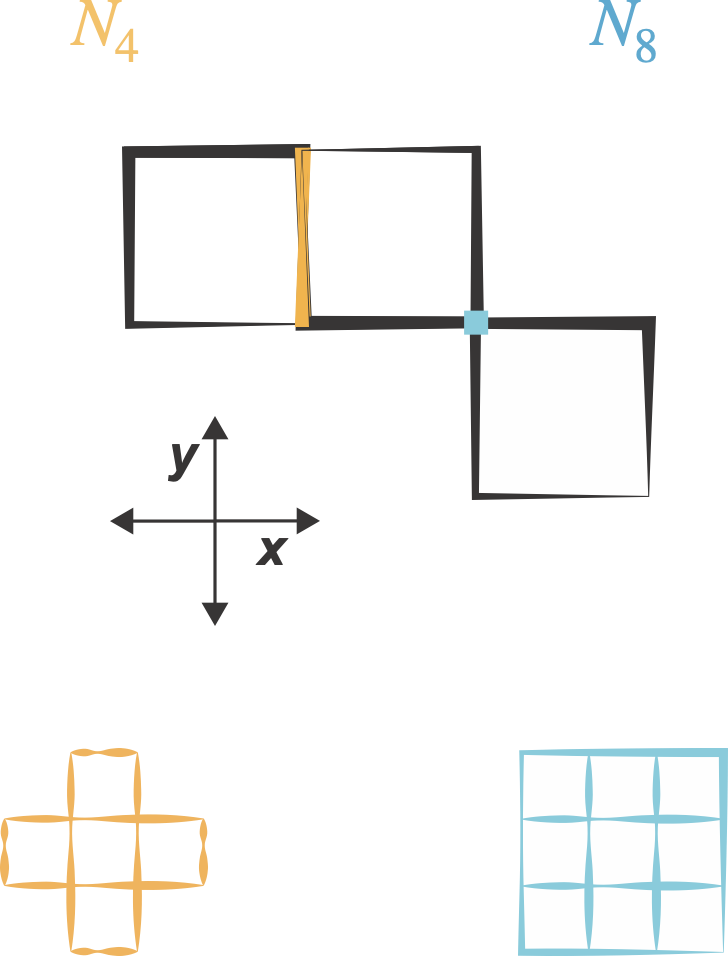
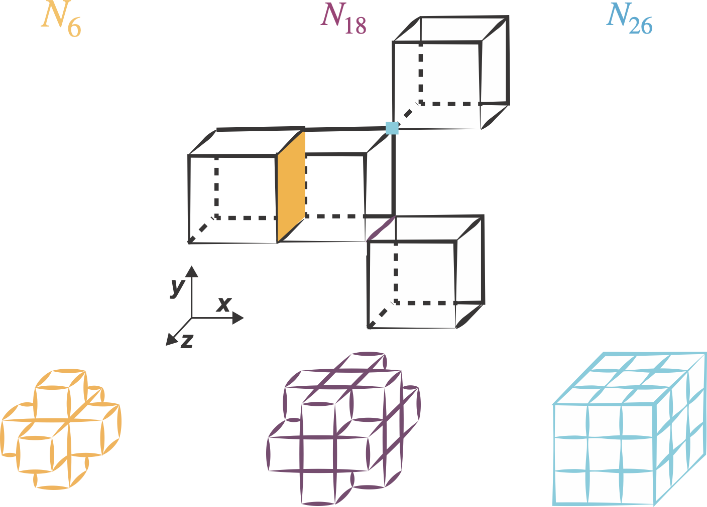

(glossary:neighborhoods)=
# Neighborhoods

Neighborhoods are at the crux of digital topology methods. In skeletonization, the neighborhood you choose reflects how many of the surrounding pixels/voxels will be used to evaluate if a pixel in the image foreground is critical to its shape basis. By increasing the number of possible neighbors, you increase the flexibility of the resulting skeletons.

## 2D Neighborhoods
In 2D there are two possible neighborhoods, referred to as N4 and N8. The N4 neighborhood only considers pixels that share an edge with the position currently being assessed. The N8 neighborhood considers both edge sharing and vertex sharing pixels. 

## 3D Neighborhoods

In 3D there are three possible neighborhoods, referred to as N6, N18 and N26. The N6 neighborhood only considers voxels sharing a face with the current position. The N18 neighborhood considers face sharing and edge sharing voxels. Finally, the N26 neighborhoods considers face sharing, edge sharing and vertex sharing voxels. 

