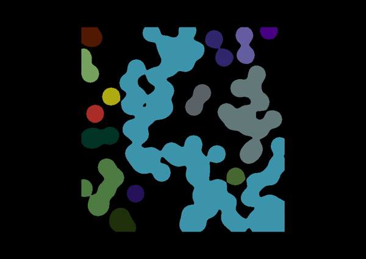

(glossary:skeleton_components)=
# Skeleton components

## Spine

In napari-toska, the spine of a skeleton refers to the longest simple path that can be traversed along individual skeleton branches. This means that between two end points of the skeleton the greatest amount of the object’s shape asymmetry is explored.

## Branches

An individual branch is a length of connected pixels/voxels in a skeleton with a unique skeleton-wise identifier that is situated between either two end points, two branching points or a branching point and an end point. The sum of foreground neighbors for each pixel/voxel of a branch is equal to 2.

## End Points

Within a skeleton, an end point is classified as a pixel/voxel where the sum of its foreground neighbors is equal to 1.

## Branching Points

Within a skeleton, a branching point is classified as a pixel/voxel where the sum of its foreground neighbors is equal to or greater than 3.
