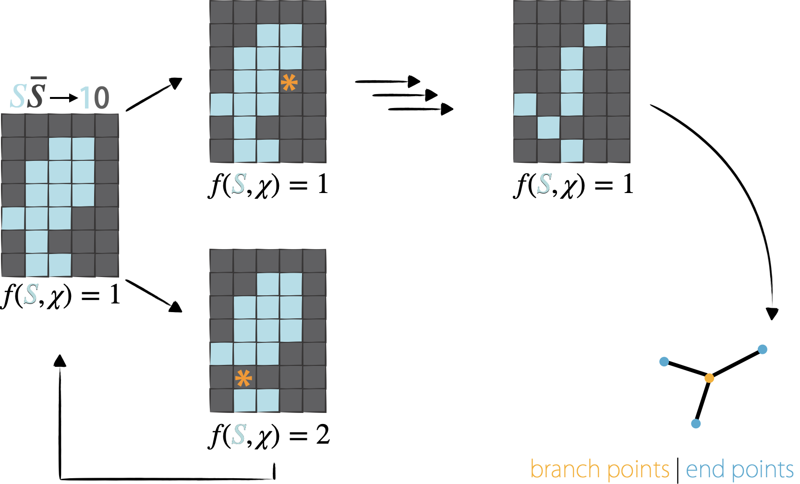

(glossary:topological_skeleton)=
# Skeletonization

Skeletonization algorithms are discretized versions of the Medial Axis Transform {cite}`blum1973biological,blum1978shape,blum1967transformation`. Topological skeletons are generated to reflect the minimal basis of on object’s shape asymmetry and its algebraic topology (i.e., [Euler characteristic](https://en.wikipedia.org/wiki/Euler_characteristic)). The algorithm used by napari-toska is from Lee et al., 1994 {cite}`lee1994building`, which utilizes the N8 or N26 neighborhood depending on the number of spatial dimensions of the input instance segmented image.

